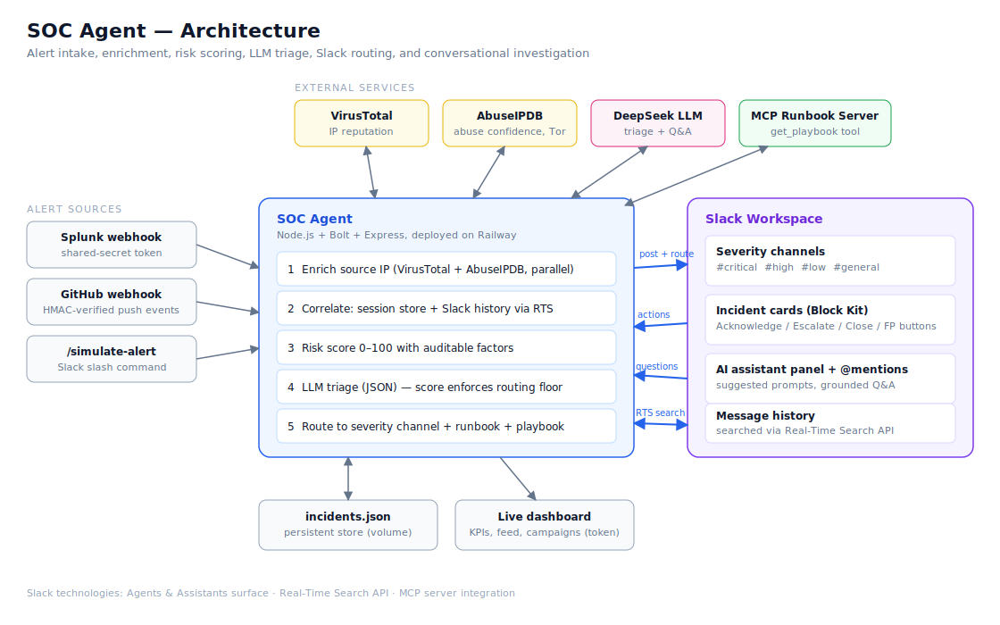

# SOC Agent

A Slack agent that turns raw security alerts into triaged, enriched, routed incidents — and answers questions about them in plain English.

Security teams drown in alerts. Most are noise, but the dangerous ones need context (is this IP known-bad? has it hit us before?) and speed. SOC Agent does the first 15 minutes of analyst work automatically, inside Slack, in seconds.

## What it does

When an alert arrives (from Splunk, GitHub, or the `/simulate-alert` command):

1. **Enriches** the source IP against VirusTotal and AbuseIPDB in parallel — detection counts, abuse confidence, Tor exit status, ISP, geography.
2. **Correlates** it with past incidents from the same IP, using both the in-memory session and Slack's Real-Time Search API to find incidents from previous sessions in message history — so the agent remembers attacks across restarts.
3. **Scores** the incident 0–100 with a deterministic risk model (alert type, asset criticality, threat intel signals, correlation count) that produces an auditable factor breakdown.
4. **Triages** with an LLM (DeepSeek) that receives all of the above and returns severity, category, summary, response playbook, false-positive likelihood, and a routing decision — with the risk score acting as a floor, so a weak model response can never bury a high-evidence incident.
5. **Routes** the incident card to the right channel (`#critical`, `#high`, `#low`, `#general`) with interactive buttons: Acknowledge, Escalate, Close, False Positive. P1s ping the channel.
6. **Fetches the runbook** for the incident category from a remote MCP server — owner team, SLA, and step-by-step playbook, embedded in the card.

Analysts can then **talk to the agent**:

- **AI assistant panel** — open the app in Slack's AI sidebar, get suggested prompts, and ask things like "which incident has the highest risk score?" or "what do we know about 185.220.101.47?". Answers are grounded in live incident data and RTS history search.
- **@mention** the bot in any channel for the same Q&A in a thread.

A **live web dashboard** (token-protected) shows KPI tiles, an expandable incident feed with attack narrative, blast radius, timeline, and playbook — plus a Campaigns view that groups incidents by source IP into attack chains.

## Slack technologies used

- **Slack AI capabilities** — built on the Agents & Assistants surface (`Assistant` class in Bolt): suggested prompts, thread titles, live status while investigating.
- **Real-Time Search API** — `search.messages` powers cross-session incident correlation and the Q&A engine's history lookups.
- **MCP server integration** — runbooks are served by a separate MCP server over HTTP (`get_playbook` tool), keeping response procedures decoupled from the agent.

## Architecture



Webhooks land on the Express receiver (shared with Bolt), pass a shared-secret / HMAC check, and enter the pipeline: enrichment, correlation, scoring, LLM triage, routing. Incidents persist to a JSON file so they survive restarts; the counter, correlation, and dashboard all read from the same store. The dashboard and Q&A API are served by the same process.

## Running it

```
npm install
npm start
```

Copy `.env.example` to `.env` and fill it in. The app needs:

| Variable | Purpose |
|---|---|
| `SLACK_BOT_TOKEN` | Bot token (`xoxb-`) |
| `SLACK_SIGNING_SECRET` | Request signature verification |
| `SLACK_USER_TOKEN` | User token (`xoxp-`) with `search:read` — enables RTS correlation (optional) |
| `DEEPSEEK_API_KEY` | LLM triage and Q&A |
| `VIRUSTOTAL_API_KEY` / `ABUSEIPDB_API_KEY` | Threat intel enrichment |
| `SLACK_CHANNEL_ID` | Default channel for incoming alerts |
| `SLACK_CHANNEL_P1` / `_P2` / `_P3` / `_GENERAL` | Severity-routed channels |
| `SPLUNK_WEBHOOK_SECRET` | Auth for `POST /webhook/splunk` (header `x-webhook-token` or `?token=`) |
| `GITHUB_WEBHOOK_SECRET` | HMAC verification for `POST /webhook/github` |
| `DASHBOARD_TOKEN` | Access token for the dashboard and API |
| `PORT` | Set by the host platform; defaults to 3000 |
| `DATA_DIR` | Where `incidents.json` lives; mount a volume in production |

Slack app configuration: enable **Agents & AI Apps**, subscribe to the `assistant_thread_started`, `assistant_thread_context_changed`, `message.im`, and `app_mention` bot events at `/slack/events`, and grant the scopes listed in `.env.example`. Slash commands: `/simulate-alert`, `/soc-stats`.

## Field guide: what the agent produces and why

Every incident goes through the same investigation the analyst would have done by hand. The card is laid out in the order an analyst thinks: what happened, how bad is it, what does the evidence say, have we seen this attacker before, and what do we do about it.

### The Slack incident card

**Header and status banner** — `INCIDENT #1002 · P1 BRUTE FORCE` plus a banner with the severity label (`P1 CRITICAL`), lifecycle status (`OPEN`, `ACKNOWLEDGED`, `CLOSED`, `FALSE POSITIVE` — with who actioned it), the risk score (`Risk 100/100`), and the detection timestamp.

**Key facts** — the raw alert, normalized:
- *Type* — the detection category from the source system (Brute Force Attempt, Data Exfiltration Spike, Port Scan, Malware Hash, Suspicious File Push).
- *Source IP / Target* — attacker address and the asset it touched. These two fields drive everything downstream: the IP is what gets enriched and correlated, the target is what feeds blast-radius and asset-criticality scoring.
- *Confidence* — the model's confidence in its own triage (High/Medium/Low).
- *Escalate to* — which team the AI thinks should own the response.
- *Channel routed* — where the incident landed (CRITICAL/HIGH/LOW/GENERAL).
- *Detail* — the original event text from Splunk/GitHub, unmodified, so the analyst always sees the ground truth.

**Routing Decision** — one sentence of reasoning for why this incident went to this channel. If the deterministic risk floor overrode the model, that is stated here too (`Raised to CRITICAL by risk score 100/100`), so routing is never a black box.

**False-Positive Likelihood** — a percentage with reasoning. This is deliberately separate from severity: an alert can be technically severe but probably benign (an internal scanner tripping brute-force rules), and the agent says so.

**Threat Intelligence** — the enrichment results, fetched live at alert time:
- *VirusTotal* — how many of ~90 AV engines flag the source IP as malicious, plus country and network owner. This answers "is this IP known-bad globally?"
- *AbuseIPDB* — community abuse confidence (0–100%), total abuse reports, and whether the IP is a Tor exit node. This answers "is this IP actively abusive right now?"

**Risk score breakdown** — the deterministic 0–100 score with every contributing factor and its points, e.g. `Brute force pattern (+15) · Production or database asset targeted (+10) · VirusTotal: 14 engines flag IP as malicious (+30) · AbuseIPDB confidence 100% (+25) · Source is a Tor exit node (+10) · 4 correlated incidents from the same IP (+25)`. This is the auditable half of the hybrid scoring: an analyst can dispute any line of it, and it acts as a floor under the LLM's routing.

**Correlated incidents** — the agent's memory. Before triage, it looks for other incidents from the same source IP in two places: the current incident store, and the workspace's own message history via Slack's Real-Time Search API (which is how correlation survives restarts and redeploys). Each hit is listed with its ID, type, target, severity, and status. Multiple hits reframe the incident from "an event" to "a stage in a campaign", and the AI's severity assessment is explicitly told about them.

**Runbook** — fetched from the MCP server by category: owning team, response SLA in minutes, and the step-by-step procedure. Response knowledge stays centralized on the MCP server instead of being hardcoded into the bot.

**AI Triage Summary** — two or three sentences of narrative synthesis: what is happening, in the context of the enrichment and correlations, and why it matters.

**Response Playbook** — three time-boxed actions: *Now (5 min)* contain, *Soon (1 hr)* investigate, *Prevent* fix the root cause. Generated per-incident from the full evidence, not from a template.

**Action buttons** — *Acknowledge* (analyst takes ownership), *Escalate* (moves the incident one channel up, re-posts it there, retires the old thread, and raises severity to match — with a confirmation dialog), *Close* (resolved), *False Positive* (dismissed). Every click updates the card, posts an audit message to the thread, and lands in the incident's timeline.

### The dashboard

**KPI tiles** — totals at a glance: incident count (with how many are correlated), the P1–P4 severity split, open/acknowledged counts, resolution rate, and false-positive rate with the top threat category.

**Incident Feed** — one card per incident: severity color bar, type, status, linked-incident badge, the AI summary, and a metadata row (source, destination, geo, VirusTotal ratio, abuse confidence, risk score, route, time). Click to expand:

- **Attack Narrative** — the alert detail plus, when correlations exist, an explicit statement that this is not an isolated event, followed by the routing reasoning and false-positive assessment.
- **Blast Radius** — every asset touched by this source IP across *all* of its correlated incidents (not just this one), the teams pulled into the response, and the attacker's origin (country, ISP, Tor status). This turns "one alert, one host" into the actual footprint of the attacker.
- **Timeline** — the attack reconstructed in order: prior incidents from the same IP first (each marked with whether it came from this session or was found in Slack history), then this incident's lifecycle events — created, acknowledged, escalated (with severity change and analyst), closed or dismissed — each timestamped and attributed.
- **Response Playbook / Threat Intel / Risk Score / Runbook** — the same evidence as the Slack card, kept side-by-side so the dashboard stands alone during a review.

**Campaigns view** — the feed regrouped by attacker. Any source IP with more than one incident becomes a campaign block: worst severity, incident count, how many are still active, the *attack chain* (the sequence of categories, e.g. `Reconnaissance → Brute Force → Data Exfiltration`), and the combined blast radius. The incidents inside are ordered oldest-first so the block reads as the story of the attack. Isolated one-off incidents are listed separately below.

## Deployment

The live instance runs on Railway and auto-deploys from this repo's `main` branch. Any Node host works: set the environment variables above, make sure the platform's assigned `PORT` is used (Railway injects it), and mount a persistent volume for `DATA_DIR` if incidents should survive redeploys. Point every Slack request URL (slash commands, event subscriptions, interactivity) at `https://<your-domain>/slack/events`, and remember Splunk 9+ requires the webhook URL to be added to its webhook allow list.

## Demo walkthrough

1. Run `/simulate-alert` — watch the alert get enriched, scored, and routed to a severity channel within seconds.
2. Open the incident card: risk factor breakdown, threat intel, correlated incidents, runbook, response playbook.
3. Fire a second alert from the same IP (Splunk webhook) — the new card links the prior incident and flags a possible campaign.
4. Click Escalate — the incident moves up a channel, severity syncs, the old thread is retired.
5. Open the AI assistant panel and ask: "Are any source IPs behind multiple incidents?"
6. Open the dashboard — Campaigns view shows the attack chain and blast radius.

## Endpoints

| Route | What |
|---|---|
| `POST /webhook/splunk` | Splunk alert intake (token-guarded) |
| `POST /webhook/github` | GitHub push intake, flags sensitive filenames (HMAC-verified) |
| `GET /dashboard` | Live console (token-guarded) |
| `GET /api/incidents`, `/api/stats` | Dashboard data (token-guarded) |
| `GET /api/ask?q=...` | The Q&A engine over HTTP (token-guarded) |
